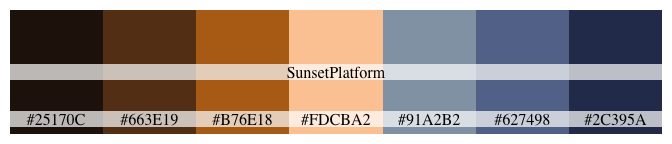
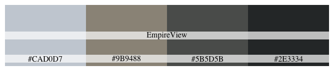

<!-- README.md is generated from README.Rmd. Please edit that file -->

# nycpalettes

<!-- badges: start -->

<!-- badges: end -->

Small R package that contains color palettes based on pictures that I
(and [Sharath Koorathota](https://github.com/schko)) took around NYC.

Created using the [colorfindr](https://github.com/zumbov2/colorfindr)
package and heavily inspired by the
[wesanderson](https://github.com/karthik/wesanderson) package.

## Installation

Development version on [GitHub](https://github.com/):

``` r
# install.packages("devtools")
devtools::install_github("kellycotton/nycpalettes")
#> Skipping install of 'nycpalettes' from a github remote, the SHA1 (0fbdb75b) has not changed since last install.
#>   Use `force = TRUE` to force installation
```

## Example

``` r
library(nycpalettes)
library(ggplot2)

ggplot(mtcars, aes(mpg, disp, color = factor(gear))) + geom_point() +
  scale_color_manual(values = nyc_palette("DUMBO"))
```


## Palettes


``` r
nyc_palette("ParkBlossoms")
```


``` r
nyc_palette("SunsetPlatform")
```




``` r
nyc_palette("EmpireView")
```




``` r
nyc_palette("Sunset1")
```


``` r
nyc_palette("Skyline1")
```


``` r
nyc_palette("Skyline2")
```


``` r
nyc_palette("ShoreSkyline")
```


``` r
nyc_palette("Empire")
```


``` r
nyc_palette("Statue1")
```


``` r
nyc_palette("Statue2")
```


``` r
nyc_palette("World")
```


``` r
nyc_palette("Met")
```


``` r
nyc_palette("BrooklynBridge")
```


``` r
nyc_palette("DUMBO")
```


``` r
nyc_palette("Yankees")
```


